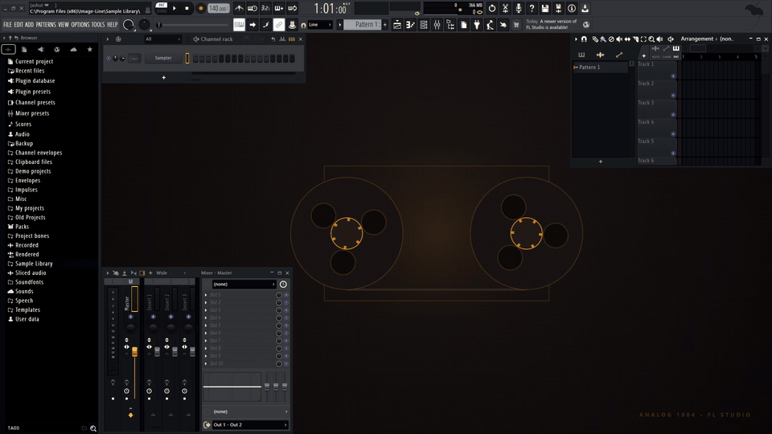

# 🎛️ FL Studio Theme Designer & AI Skill

[](LICENSE)
[](https://www.python.org/)
[](https://www.image-line.com/)
[](SKILL.md)

A production-grade CLI toolkit and cross-platform **AI Agent Skill** to design, inspect, and install custom themes (`.flstheme`) with companion wallpapers and GPU-accelerated dynamic HTML5 backgrounds for **Image-Line FL Studio**.

Compatible with **Google Antigravity**, **Claude Code**, **Gemini CLI**, and **ChatGPT/Codex**.

> 🌐 **Interactive Web Showcase**: Test all 12 themes and dynamic animations live in your browser at **[ashutoshiwnl.github.io/fl-studio-theme-skill](https://ashutoshiwnl.github.io/fl-studio-theme-skill/)**

<p align="center">
  
  <br>
  <em>Live in-DAW capture of <b>Analog 1984</b> with dual spinning magnetic tape reels running in FL Studio.</em>
</p>

---

## 🎨 Shipped Theme Presets

All 17 bundled themes include balanced UI contrast, high-contrast channel rack steps, custom mixer peak meters, 318×180 preview thumbnails, and companion wallpapers:

| Theme | Aesthetic | Primary Accent | Dynamic HTML Animation |
| :--- | :--- | :--- | :--- |
| **Nurture** | Porter Robinson Nature | `#4EFA94` (Electric Mint) | Drifting glowing fireflies & spores |
| **Cyber Blossom** | Neo-Tokyo Sakura Night | `#FF2A85` (Sakura Pink) | Falling illuminated cherry blossom petals |
| **Tokyo Night** | Midnight Slate / Indigo | `#7AA2F7` (Tokyo Blue) | Twinkling stars & ambient celestial drift |
| **Cyberpunk 2077** | Matte Carbon / Neon | `#FCEE0A` (Cyber Yellow) | Animated 3D retro-future cyber grid |
| **Synthwave 84** | 80s Outrun Retro | `#FF71CE` (Neon Pink) | Retro wireframe horizon & neon sunset |
| **Catppuccin Mocha** | Soothing Pastel Charcoal | `#CBA6F7` (Mauve) | Drifting pastel aurora waves |
| **Dracula** | Vampiric Dark Slate | `#BD93F9` (Purple) | Atmospheric drifting gothic mist |
| **OLED Crimson** | Pure Pitch OLED Black | `#FF1744` (Vivid Crimson) | Pulsing radial audio energy core |
| **Abyssal Leviathan** | Deep-Sea Bioluminescence | `#00F5D4` (Aqua Mint) | Bioluminescent jellyfish & drifting marine snow |
| **Analog 1984** | Vintage Japanese Tape Deck | `#FFB703` (VU Meter Amber) | Dual spinning cassette reels & reel tape counter |
| **Cyberdeck** | CRT Phosphor Terminal | `#39FF14` (Phosphor Green) | Matrix digital rain with CRT scanline decay |
| **Solaris** | Celestial Supernova | `#FFD166` (Pulsar Gold) | Breathing pulsar core & orbiting coronal rings |
| **Ceramic Cherry** ⚪ | Pure Porcelain White | `#FF5493` (Cherry Pink) | Drifting cherry blossom refractions on white canvas |
| **Alabaster Tangerine** ⚪ | Bauhaus Alabaster White | `#FF8441` (Tangerine) | Minimalist Bauhaus drafting lines & crosshairs |
| **Porcelain Pear** ⚪ | Porcelain White & Lime | `#75E600` (Pear Lime) | Organic pear leaves & drifting dew drops |
| **OLED Pink** 🖤 | Pitch Black & Hot Pink | `#FF1493` (Deep Hot Pink) | Electric hot pink pulsing audio energy rings |
| **OLED Emerald** 🖤 | Pitch Black & Emerald | `#00FF66` (Electric Emerald) | Radioactive emerald audio energy core |

---

## ⚡ DAW Audio-Safety & Performance Guardrails

Dynamic wallpapers run within FL Studio's embedded WebKit/Chromium container alongside the real-time audio engine (ASIO). Poorly optimized web animations can cause CPU spikes, GPU VST context contention, and audio underruns (buffer dropouts/clicks).

All dynamic wallpapers generated by this skill strictly enforce:
1. **Delta-Time FPS Capping (30-35 FPS)**: Throttles the `requestAnimationFrame` loop to prevent wasting GPU cycles on 144Hz-240Hz monitors while running DSP-heavy plugins.
2. **Object Pooling (Zero-GC Loop)**: All particles, reels, and drops are pre-allocated at startup. Zero heap allocations (`new`) occur inside the animation tick, eliminating Garbage Collection pauses during playback.
3. **Occlusion & Tab Visibility Listener**: Automatically suspends rendering via `document.addEventListener('visibilitychange')` when FL Studio is minimized or the background is occluded.
4. **100% Offline & Self-Contained**: Zero external scripts, CDNs, or remote fonts. Functions completely air-gapped without internet access.


---

## 🚀 3 Ways to Use

### 1. Instant 1-Click Install (No Python Required)
For music producers who just want great themes:
1. Download **`fl-studio-themes-pack.zip`** from the latest release (or build with `python build_dist.py`).
2. Extract the contents directly into your FL Studio Themes directory:
   * **Windows**: `%USERPROFILE%\Documents\Image-Line\FL Studio\Settings\Themes\`
   * **macOS**: `~/Documents/Image-Line/FL Studio/Settings/Themes/`
3. Open FL Studio, press **`F10`** (or go to *Options $\rightarrow$ Theme settings*), and select any theme!

---

### 2. Use as an AI Skill (Pair Programming)
Instruct your AI assistant to generate tailored themes using natural language.

#### For Google Antigravity
Place the skill into your project:
```
.agents/skills/fl-studio-theme/SKILL.md
```
Then ask naturally in chat:
> *"Create an Autumn Sunset theme with warm amber and orange tones, dark charcoal steps, and an animated particle wallpaper, and install it."*

#### For Claude Code / Claude Projects
Add `SKILL.md` to your workspace:
```
.claude/skills/fl-studio-theme/SKILL.md
```
Or upload `SKILL.md` into your Claude Project knowledge files.

#### For ChatGPT / Codex / Gemini CLI
Upload `SKILL.md` and `generator.py` to the context window or paste into Custom GPT instructions.

---

### 3. Developer & CLI Tool

#### Install Dependencies
```bash
pip install -r requirements.txt
```

#### CLI Examples
```bash
# Install Cyber Blossom with dynamic falling petals
python generator.py --preset cyber-blossom --dynamic-html --install

# Install Nurture with organic meadow palette
python generator.py --preset nurture --dynamic-html --install

# Generate a custom theme from scratch
python generator.py \
  --name "Lo-Fi Coffee" \
  --selected "#D4A373" \
  --highlight "#CCD5AE" \
  --hue 25 \
  --saturation 70 \
  --contrast 35 \
  --dynamic-html \
  --install

# Extract a complete color palette from album artwork or image
python generator.py \
  --name "Discovery" \
  --extract-from-image "C:/art/album_cover.png" \
  --dynamic-html \
  --install

# Inspect or compare themes side-by-side
python inspector.py --list
python inspector.py "C:\path\to\theme.flstheme"
python inspector.py --diff "Themes/Nurture.flstheme" "Themes/Cyber Blossom.flstheme"
```

#### Run Ergonomic Guardrails & Test Suites
```bash
# Run unit tests and workflow simulation
python test_generator.py -v
python test_skill_workflow.py -v
python test_validator.py -v

# Build standalone distribution zip
python build_dist.py
```

---

## 🔬 How FL Studio Theme Files Work

FL Studio stores themes as plain text `.flstheme` files. All colors are encoded as **32-bit signed two's complement integers** representing `0xAARRGGBB`:

$$\text{unsigned} = (\text{Alpha} \ll 24) \mid (R \ll 16) \mid (G \ll 8) \mid B$$
$$\text{signed} = \text{unsigned if unsigned} < 0x80000000 \text{ else } \text{unsigned} - 0x100000000$$

Because fully opaque colors have Alpha set to `255` (`0xFF`), the 31st bit is set, appearing as **negative numbers**:
* Pure White (`#FFFFFF`, $\alpha=255$): `-1`
* Pure Black (`#000000`, $\alpha=255$): `-16777216`
* Cyber Yellow (`#FCEE0A`, $\alpha=255$): `-197110`
* Grid Backgrounds ($\alpha=0$): Positive integer (e.g. `1183251`)

---

## ❓ FAQ & Troubleshooting

### Why did my custom theme turn solid black?
If `Lightness` is set lower than `-100` (e.g. `-180` to `-240`), FL Studio crushes panel contrast and renders elements pitch black. Always keep `Lightness` between `-50` and `-85` for dark themes. Also ensure `BackPicFilename` or `BackHTMLFileName` is defined so the workspace canvas does not render as an untextured void.

### How does the background wallpaper load?
* **Automatic Mode**: The companion wallpaper (`<Theme> - Wallpaper.png`) is linked natively in `.flstheme` (`BackPicFilename`) and loads **immediately** upon selecting the preset in `F10`.
* **Dynamic Animated Mode**: Go to **View $\rightarrow$ Background $\rightarrow$ Set dynamic wallpaper / HTML document...** and select the `wallpaper.html` file inside the theme's folder.

### What does FL Studio's Hue slider do?
* `0`: Neutral slate / warm gray
* `+20` to `+35`: Sea grass / Aqua
* `+50` to `+70`: Organic Meadow / Forest Green
* `-20` to `-30`: Cool Slate Blue (Tokyo Night)
* `-40` to `-50`: Indigo / Blue-Purple
* `-60` to `-80`: Purple / Magenta (Synthwave, Veela)

---

## 📄 License

MIT License. Free for music producers, sound designers, and developers.
